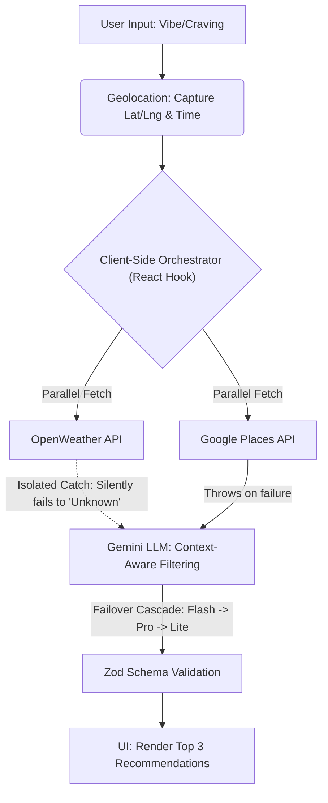

<div align="center">
  <h1>😋 YumYumGo </h1>
  
  <br><br>
  
  [](LICENSE)
  [](https://react.dev/)
  [](https://vitejs.dev/)
  [](https://tailwindcss.com/)
  [](https://vercel.com/)
  [](https://ai.google.dev/)
  [](https://developers.google.com/maps/documentation/places/web-service)
  [](https://openweathermap.org/)

</div>

## 1. Project Overview

### Problem Statement

#### ❓ The Universal Question of the Day: "What should we eat today?"

A simple question that somehow turns into a 30-minute discussion.

Whether it's lunch with friends, dinner with family, or a quick meal between classes, people often struggle to decide what to eat. The universal answers to this specifically universal question — "Anything lah", "I don't know", or "You decide" — often lead to endless scrolling through food delivery apps and an infinite loop of indecision.

This phenomenon, commonly known as _decision fatigue_, wastes time and makes meal planning unnecessarily frustrating. With thousands of dining options available, choosing the right meal can sometimes be harder than finding the meal itself.

### SDG Alignment

| [](https://sdgs.un.org/goals/goal11) |
| :-- |
| Supports community economic resilience under SDG 11.4 by utilizing the Gemini engine to intelligently surface independent, local culinary options alongside major commercial chains, helping drive hyper-local economic traffic. |

### Short Description of the Solution

**YumYumGo** is an intelligent food recommendation platform designed to eliminate food decision fatigue. By analyzing factors such as user location, current weather, time of day, budget, and cravings, YumYumGo delivers personalized meal recommendations tailored to each user's situation.

Instead of spending valuable time debating where to eat, users receive smart, context-aware suggestions that help them discover the perfect meal in seconds.

> [!TIP]
> **Because "Anything Lah" Isn't Helpful.**

### 📂 Project Structure

```text
├── api                                 # Vercel Serverless Functions (Backend)
│   ├── gemini.ts                       # Google AI integration (Prompt engineering & model failover cascade)
│   ├── photo.ts                        # Fetches restaurant images via Google Places Photo API
│   ├── places.ts                       # Queries Google Places API (New) for localized restaurants
│   └── weather.ts                      # Fetches real-time weather context from OpenWeather API
├── docs                                # Project Documentation
│   ├── OVERVIEW.md                     # System architecture, pipeline details, and failure states
│   ├── TESTPLAN.md                     # QA test cases, focusing on the orchestrator and failovers
│   └── yumyumgo.png                    # Logo image
├── public                              # Public static assets
│   ├── favicon.svg                     # App favicon
│   └── icons.svg                       # Global SVG sprite/icons
├── src                                 # React Frontend Source Code
│   ├── app                             # Page components (Vite/React Router structure)
│   │   ├── processing                  
│   │   │   └── page.tsx                # Loading state UI during the 3-phase parallel API execution
│   │   ├── results                     
│   │   │   └── page.tsx                # Final UI rendering the top 3 curated restaurant recommendations
│   │   ├── roulette                    
│   │   │   └── page.tsx                # Framer Motion "Food Roulette" wheel for selecting food vibes
│   │   ├── layout.tsx                  # Main layout wrapper component
│   │   └── page.tsx                    # Landing/Home page
│   ├── assets                          # Local static assets (images, vectors)
│   │   ├── hero.png                    # Hero image for the landing page
│   │   ├── react.svg                   
│   │   └── vite.svg                    
│   ├── hooks                           # Custom React Hooks
│   │   ├── useGeolocation.ts           # securely captures user's GPS coordinates
│   │   ├── useOrchestrator.test.ts     # Unit/Integration tests for the pipeline orchestrator
│   │   └── useOrchestrator.ts          # Core state machine managing parallel context gathering & 9000ms timeouts
│   ├── store                           # Zustand Global State
│   │   └── useSessionStore.ts          # Transient state manager (coordinates, selected vibe, API results)
│   ├── App.css                         # App-specific styles
│   ├── App.tsx                         # Root React component
│   ├── index.css                       # Global Tailwind CSS v4 entry point
│   └── main.tsx                        # React DOM rendering entry point
├── .env.example                        # Template for required API keys (Gemini, Places, Weather)
├── .gitignore                          # Git ignore rules
├── LICENSE                             # Open-source license
├── README.md                           # Main project documentation and submission details
├── eslint.config.js                    # ESLint configuration for code quality
├── index.html                          # Main HTML template file
├── package-lock.json                   # Exact dependency versions
├── package.json                        # Project metadata, scripts, and dependencies
├── tsconfig.app.json                   # TypeScript config for the frontend app
├── tsconfig.json                       # Base TypeScript configuration
├── tsconfig.node.json                  # TypeScript config for Vite/Node execution
├── vercel.json                         # Vercel deployment configuration & serverless routing
└── vite.config.ts                      # Vite build tool configuration
```

## 2. Technical Architecture
The core AI engine runs on a 3-stage pipeline orchestrated by the React Client, utilizing **Resilient Parallel Fetching** to call isolated Vercel Serverless Functions (`/api/*`):
1. **Geolocation & Context:** The client securely captures user coordinates and the local time of day.
2. **Parallel Data Aggregation:** 
   - **Weather API (OpenWeather):** Fetched simultaneously. If it fails, it gracefully degrades to "Unknown" without blocking the pipeline.
   - **Google Places API (New):** The critical path. Queries nearby open restaurants matching the user's vibe, filtering aggressively by radius and price level.
3. **Gemini LLM (Google AI):** Feeds the localized restaurant list, weather, time, and budget context into a strict LLM prompt. Gemini acts as the culinary judge, returning exactly 3 curated recommendations enforced by strict `zod` runtime schema validation.



---

## 3. Core Features

| Feature                               | Description                                                                                                              | Technical Approach                                                                                                                                                                        |
| ------------------------------------- | ------------------------------------------------------------------------------------------------------------------------ | ----------------------------------------------------------------------------------------------------------------------------------------------------------------------------------------- |
| **Hyper-Personalized Context Engine** | Generates food recommendations based on real-world user context such as location, time, weather, and nearby restaurants. | Aggregates geolocation, local time, and weather data, then combines them with Google Places API results. Includes graceful fallback when optional context (e.g., weather) is unavailable. |
| **Rule-of-Three AI Curation**         | Reduces decision fatigue by limiting output to exactly three high-quality restaurant recommendations.                    | Uses Google Gemini with structured prompting and strict JSON validation to ensure consistent, deterministic outputs.                                                                      |
| **Food Roulette Experience**          | Provides an interactive and engaging UI for selecting food preferences and receiving instant recommendations.            | Built with React and Framer Motion for smooth animations. Zustand is used for lightweight state management and performance optimization during API workflows.                             |

---

## 4. Tech Stack & Rationale
| Layer | Technology | Rationale |
| :--- | :--- | :--- |
| **Frontend** | React 18 + Vite | Enables fast development with HMR, efficient builds, and a scalable component-based architecture for rapid UI iteration. |
| **Styling** | Tailwind CSS v4 | Utility-first CSS framework that accelerates UI development while maintaining design consistency and responsive layouts. |
| **Animation & Interactions** | Framer Motion | Provides smooth animations and micro-interactions that enhance the "Food Roulette" experience and overall user engagement. |
| **Backend** | Vercel Serverless Functions | Securely protects API secrets from the client-side bundle and provides a scalable, zero-infrastructure layer for handling recommendation workflows. |
| **State Management** | Zustand | Lightweight state management solution optimized for transient state updates without unnecessary component re-renders. |

---

## 5. Installation & Setup Instructions

### Prerequisites
- Node.js 18+
- npm or yarn
- API Keys for Google Gemini, Google Cloud (Places API New), and OpenWeather

### Local Setup

1. **Clone the repository**
```bash
git clone https://github.com/tianlongc/yumyumgo.git
cd yumyumgo
```

2. **Install dependencies**

```bash
npm install
```

3. **Configure environment variables**
This project uses a pre-configured environment template to simplify setup.
* Copy the example file:
```bash
cp .env.example .env.local
```

* Then fill in your API keys inside `.env.local`
```env
GEMINI_API_KEY=your_gemini_api_key_here
GOOGLE_PLACES_API_KEY=your_google_places_api_key_here
WEATHER_API_KEY=your_openweather_api_key_here
```

---

> [!IMPORTANT]
> Never commit or upload your `.env` or `.env.local` files to GitHub.
> Ensure they are included in your `.gitignore` file.

---

### Run the Project

```bash
npm run dev
```

The application will be available at:
[http://localhost:5173](http://localhost:5173)

## 6. Known Limitations & Future Roadmap

### Current Limitations

- [ ] Distance filtering uses straight-line radius calculations and does not account for real travel routes, traffic, or accessibility.
- [ ] Group dining decisions still require users to manually share recommendations outside the platform.
- [ ] AI recommendations may occasionally prioritize niche restaurants that match user preferences but have weaker ratings or review volume.
- [ ] No persistent caching layer for repeated recommendation requests, resulting in redundant API calls.
- [ ] Context understanding can sometimes be too broad, producing recommendations that feel irrelevant to the user's actual intent.

### Planned Improvements

- [ ] Integrate Google Maps Distance Matrix API to calculate realistic travel times instead of straight-line distance.
- [ ] Introduce **Share-to-Vote** sessions for collaborative food decisions with friends and family.
- [ ] Implement a **Trust Score** system combining ratings, review count, and ranking signals to improve recommendation quality.
- [ ] Add Redis-based caching to reduce API costs and improve response times during peak dining hours.
- [ ] Improve prompt engineering and context filtering to reduce irrelevant recommendations and better understand user cravings.
- [ ] Support dietary preferences such as vegetarian, halal, vegan, and allergy-aware recommendations.
- [ ] Add personalized recommendation history to learn from previous user selections.
